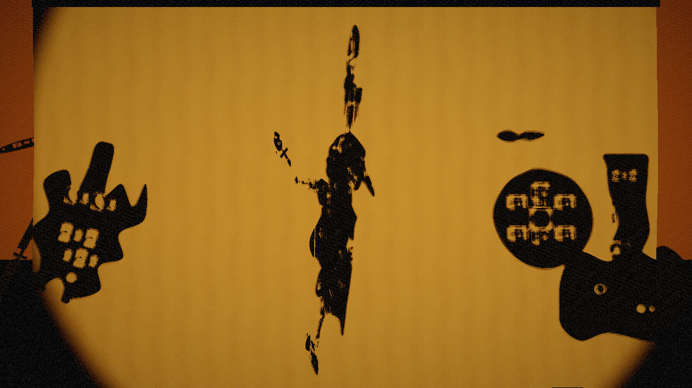
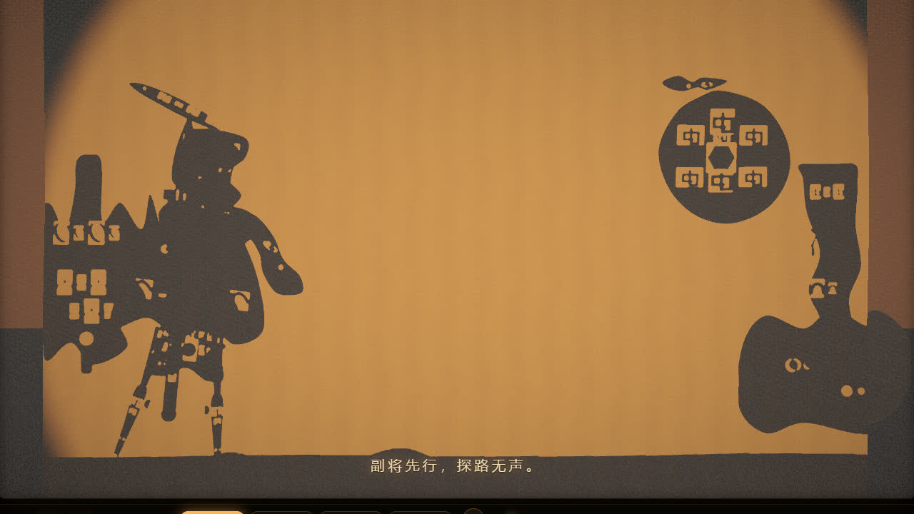
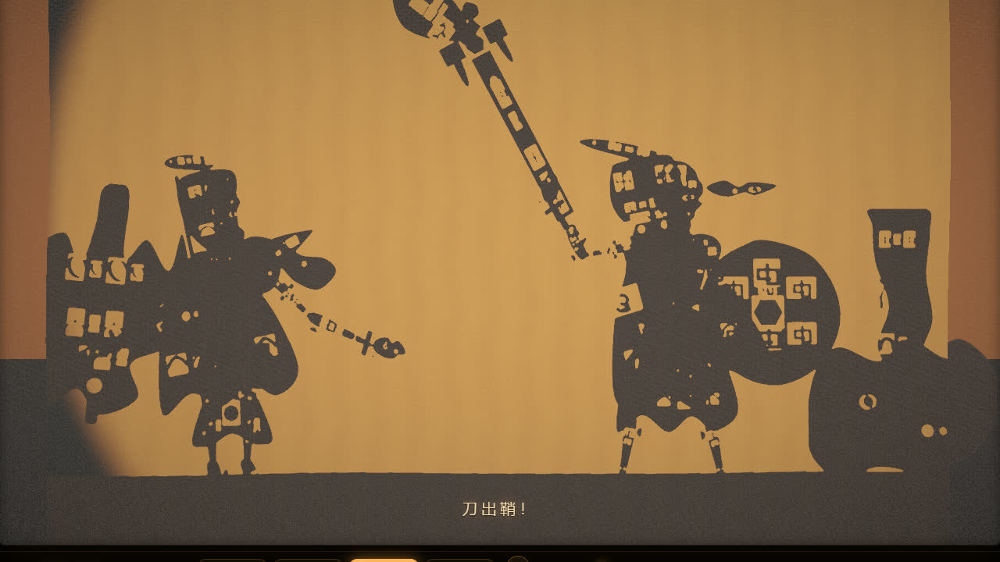
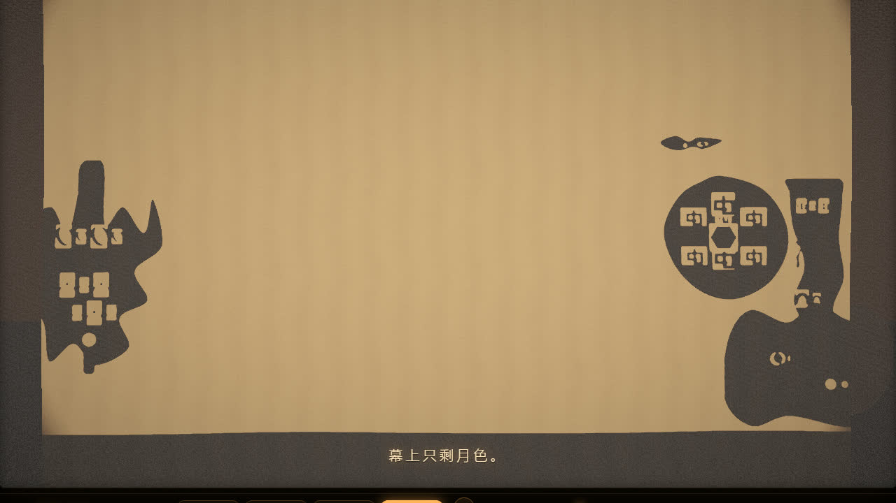
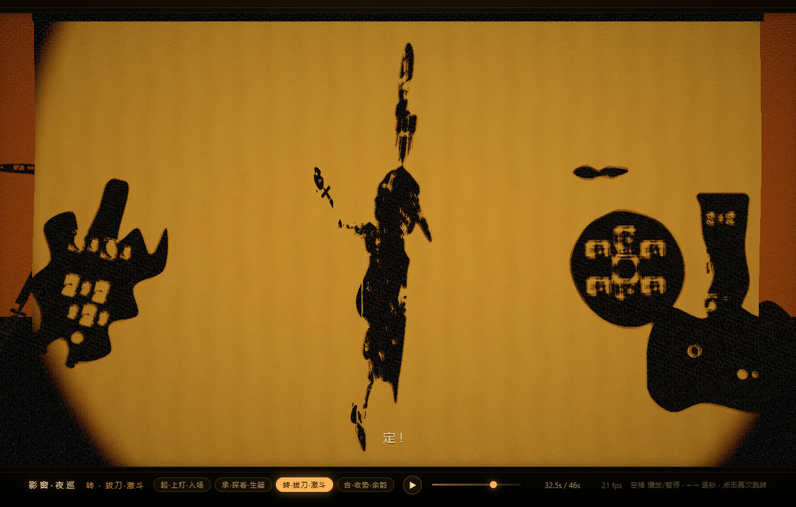
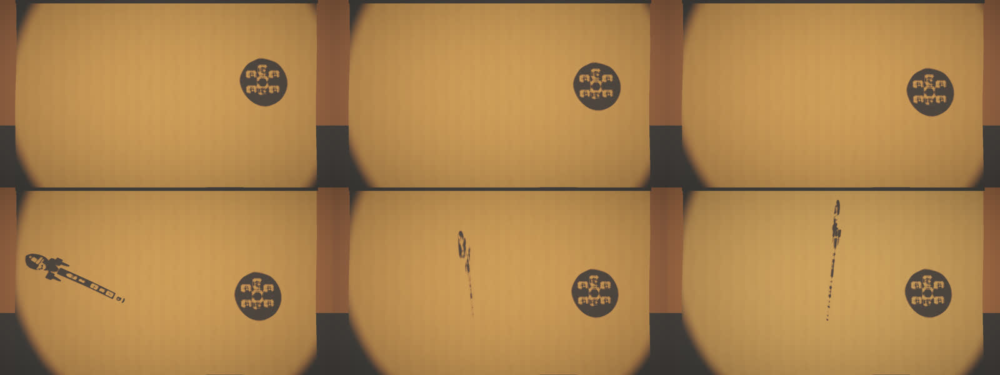

# 影窗 · 夜巡

**一场用 WebGL2 实时渲染的皮影戏** · 46 秒 · 四幕 · 26 部件真关节树 · 零 SVG · 零位图资源



**双击 `index.html` 就能看**（自包含单文件，无依赖、无需服务器）。
空格播放/暂停，← → 逐秒，点幕次按钮跳转。

> **这不是 SVG 动画。** 幕布后方是一盏真实的透视聚光灯，皮影的每个关节部件都是真实遮挡体，
> 被从灯的视角渲染进 2048² 阴影贴图。幕布上的剪影是「光被挡住」的结果，
> 镂空花纹是「光穿过孔洞」的结果。

---

## 效果

| 起 · 上灯入场 | 转 · 拔刀 |
|---|---|
|  |  |

| 合 · 收势留白 | 完整界面 |
|---|---|
|  |  |

关节是真的骨架 —— 只转上臂，手和兵器会跟着走。
独立验证组实测：只转 `upperArmR` 0.6 rad → `handR` 位移 **0.134 m**、刀尖 **0.390 m**；
而只转头时 `handR` 位移 **0.0000 m**。



## 四幕

| 幕 | 时间 | 内容 |
|---|---|---|
| **起 · 上灯 · 入场** | 0 – 11.0s | 灯由一点灯芯渐亮；副将自左侧缓步入场，落步、沉身、停住 |
| **承 · 探看 · 生疑** | 11.0 – 24.0s | 主将入场（8 步，由慢转快），停步、回头两次、抬手搭额远眺，灯焰一暗 |
| **转 · 拔刀 · 激斗** | 24.0 – 37.5s | 抽刀、两记挥刀（一大一小）、旋身甩刀、背身定格亮相 |
| **合 · 收势 · 余韵** | 37.5 – 46.0s | 收刀、退半步、转身走远（步幅衰减），灯缓缓收成一点，最后 2 秒留白 |

编排不是匀速插值，是「预备 → 发力 → 惯性过冲 → 停住」：

- 停顿 **18 处 / 合计 18.84 秒**（独立验证组用另一套阈值自算：14 处 / 17.68 秒）
- 四幕各有实测的「快 — 停 — 慢」
- 全剧峰值 **23 个关节通道同时运动**（@31.5s 旋身），紧接着 0.9 秒定格里
  除刀尖与翎羽的 0.02 rad 微颤外，**所有通道速度严格为 0**
- 步频非均匀 1.20s → 0.50s；左脚抬起时右脚支撑，相位错开

## 怎么验证

全部无需人工看图：

```bash
node tools/probe.mjs          # 引擎：11 项像素级断言（光影/镂空/织纹/暖色/动画）
node tools/e2e.mjs            # 整站：真实 index.html，11 个时间点截图 + 断言
node tools/qa-perf.mjs        # 编排：77 项断言（停顿/节奏/步态/转身/全身协同），无需浏览器
node tools/check-assets.mjs   # 造型：真跑绘制机数孔洞、校验关节挂点几何
node tools/anti-svg-check.mjs # 反 SVG：扫源码 + 磁盘 + 运行时 DOM
node tools/build-single.mjs   # 重新构建单文件（改动 src/ 之后跑这个）
node tools/repro-user.mjs     # ★ 用不带任何特殊开关的浏览器验证 file:// 直开
```

`tools/harness.mjs` 是**零依赖**的无头浏览器驱动（自己实现了最小 CDP 客户端 +
PNG 解码器），所以整条链只需要本机装了 Chrome 或 Edge，不需要 puppeteer。

## 光影管线

```
        灯（SpotLight，幕布后方 z=-3.2）
             │
  ① 从灯光视角渲染深度图 (2048² RT)
     自写深度材质在镂空处 discard → 孔洞真透光
             │
  ② 两级可分离模糊（只压锯齿，保留真实距离值）
             │
  ③ 幕布（自写 ShaderMaterial）
     顶点级褶皱 + 程序化经纬织纹 + 光锥/距离衰减
     + 逐像素遮挡判断 + 布料扩散（近实远虚）
             │  HDR (HalfFloat)
  ④ 自写后期：亮部提取 → 三级可分离模糊 → ACES → 暖调 → 颗粒 → 暗角
```

「全场没有一张位图」：织物、牛皮纸、镂空花纹、人物与道具造型全部由 canvas
程序化生成（`textures.js` + `shapes.js`，含 13 种传统花纹、370 个镂空孔洞）。

## 目录

```
index.html                    ★ 交付物：自包含单文件（构建脚本生成）
index.template.html           页面骨架 + UI + 错误兜底
src/                          ★ 源码（ES module）
  main.js            入口、装配、时间轴驱动、UI
  screen.js          ★ 幕布着色器 + ShadowStage（阴影管线）
  compositor.js      ★ 自写后期
  materials.js       ★ 部件材质 + 自定义深度材质
  stage.js           ★ 舞台：灯 / 暗框 / 背景 / 地面
  renderer.js          HDR 渲染器
  rig.js             ★ 关节树
  puppet.js / props.js / shapes.js   造型、布景、镂空花纹库
  choreography.js / ease.js          四幕时间轴、缓动与步态曲线
  textures.js                         程序化纹理
tools/                        构建 + 验收 + 调试探针
docs/images/                  README 用图
```

改完 `src/` 之后跑 `node tools/build-single.mjs` 重新生成单文件。

## 已知限制

老实说，都有独立验证组的实测数字（详见 `VERIFICATION.md`）：

- **头部部件镂空率偏低**（`head` 约 4.0%；兵器 22.5%、胸甲 16.2%、翎羽 15.8% 达标）。
  屏幕级「剪影内透光面」约 48%，但真正被实体包围的雕刻孔只有约 689 px / 93 个。
- **「光晕在边缘散开」主要靠泛光外溢**：幕布自身的中心/内侧边缘亮度比只有约 1.08×。
- **灯罩不参与投影**：能让它进阴影相机范围的参数，投影必然盖满整块幕布（实测 33.5%，
  把演员压没）；拉宽深度区间又会破坏 8bit 精度。取舍是保剪影清晰。
  需求里的「暖黄」与「边缘散开」由光照衰减 + 泛光负责，不依赖灯罩。
- 阴影贴图是 8bit 深度，只对标记了 `castShadowRaw` 的网格生效。
- 泛光是屏幕空间近似，不是体积光；只在 **SwiftShader 软件光栅**下验证过。

`VERIFICATION.md` 是**独立验证组**（未参与实现）的报告：它用 CDP 把模块闭包里的对象
提到 `window` 上做 A/B 实验，逐条对着需求给数字，开发过程中抓出了 6 项真实缺陷 ——
其中最关键的是「shadow map 实际存的是显示颜色而不是深度」，它用「把演员贴图刷白、
几何与 alpha 一字不动，剪影从 19751px 变成 0px」一锤定音，而不是靠读代码猜。

## 许可

未附开源许可证。要复用其中代码请先开 issue 说明用途。

`vendor/three.module.js` 是 three.js r160，MIT 许可，版权归 three.js 作者所有。
